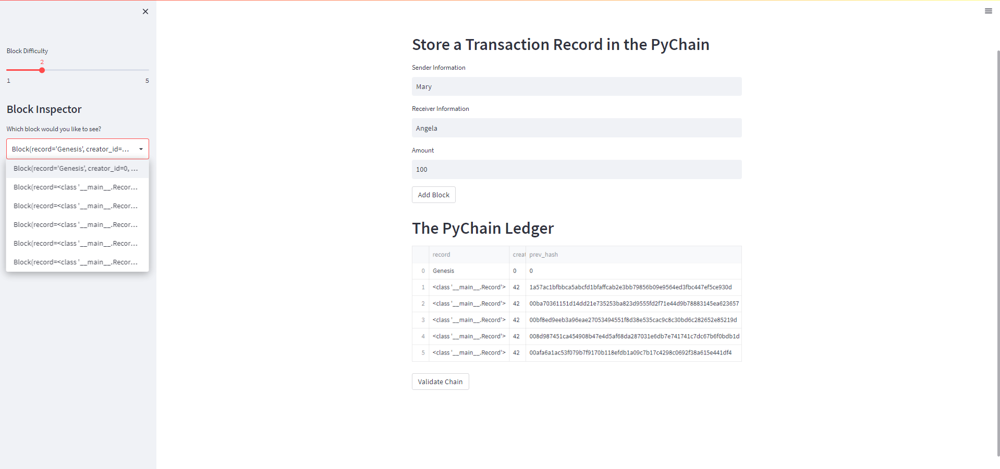
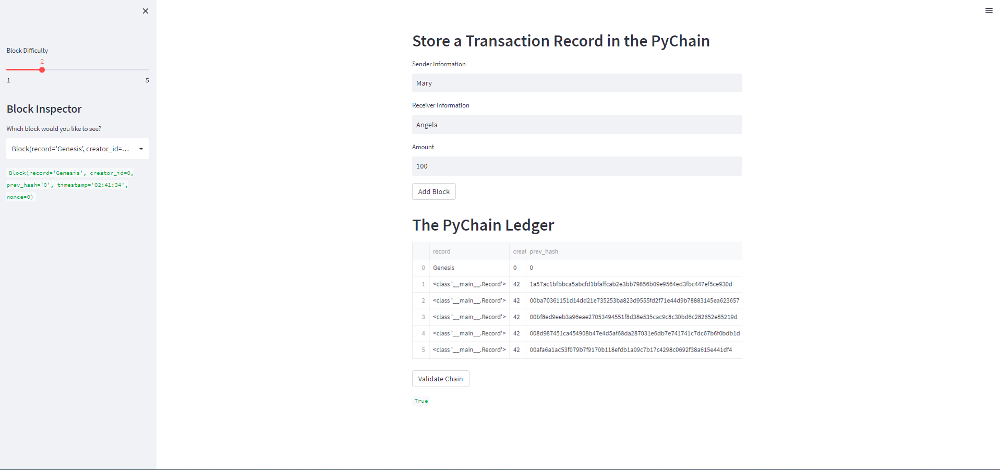

# BLOCKCHAIN LEDGER
The purpose of this program is ot build a blockchain-based ledger system, complete with a user-friendly interface that allows partner banks to conduct financial transactions (i.e. to transfer money between senders and receivers).

## Screenshots

